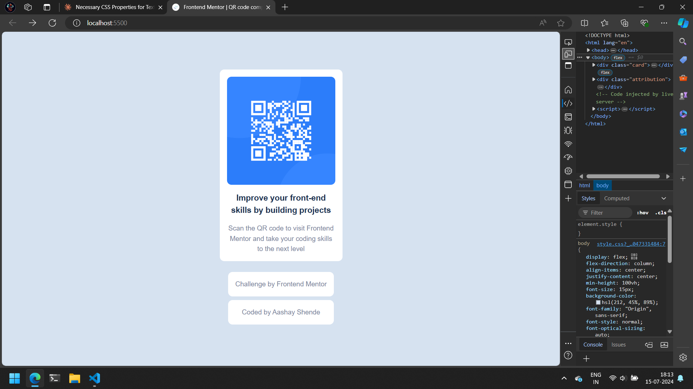
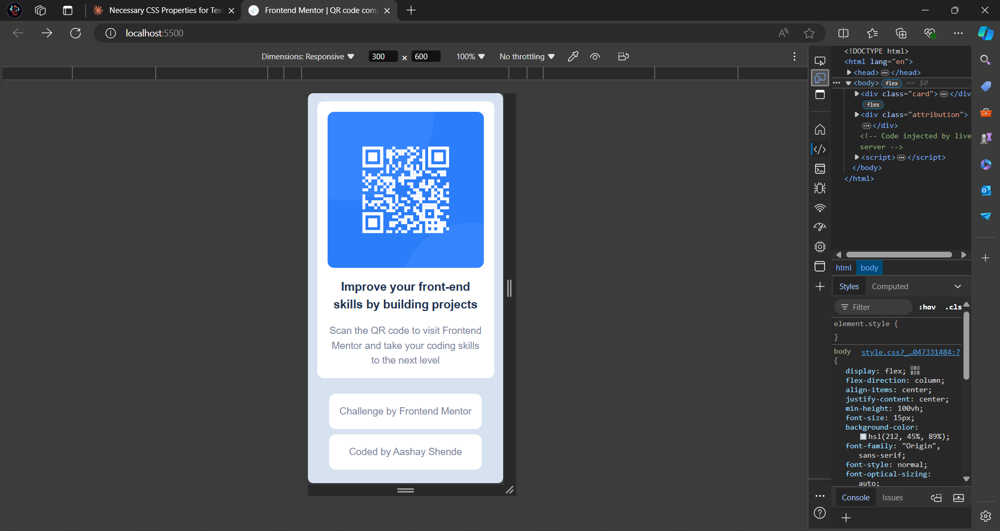

# Frontend Mentor - QR code component solution

This is a solution to the [QR code component challenge on Frontend Mentor](https://www.frontendmentor.io/challenges/qr-code-component-iux_sIO_H). Frontend Mentor challenges help you improve your coding skills by building realistic projects. 

## Table of contents

- [Overview](#overview)
  - [Screenshot](#screenshot)
  - [Links](#links)
- [My process](#my-process)
  - [Built with](#built-with)
  - [What I learned](#what-i-learned)
  - [Continued development](#continued-development)
  - [Useful resources](#useful-resources)
- [Author](#author)
- [Acknowledgments](#acknowledgments)

## Overview

### Screenshot

### Links

- Solution URL: [https://github.com/TheAashay/qr-code-component-challenge]
- Live Site URL: [Add live site URL here](https://your-live-site-url.com)

## My process

### Built with

- Semantic HTML5 markup
- CSS custom properties
- Flexbox

### What I learned

I knew what flexbox was in theory, here I learnt how and where can I apply it.
I also learnt about pseudo-class :hover and how to apply it properly.

### Continued development

This QR code project could be used as a reference to brush up concepts or as a template for my future projects.

### Useful resources

- [https://www.freecodecamp.org/learn/2022/responsive-web-design/learn-css-flexbox-by-building-a-photo-gallery/step-1](https://www.example.com) - This helped me understand the concept of flexbox.

## Author

- Frontend Mentor - [@TheAashay](https://www.frontendmentor.io/profile/TheAashay)

## Acknowledgments

Prior to this project I completed FreeCodeCamp's Responsive Web Design course which helped me at every step in this project.
[https://www.freecodecamp.org/learn/2022/responsive-web-design/]